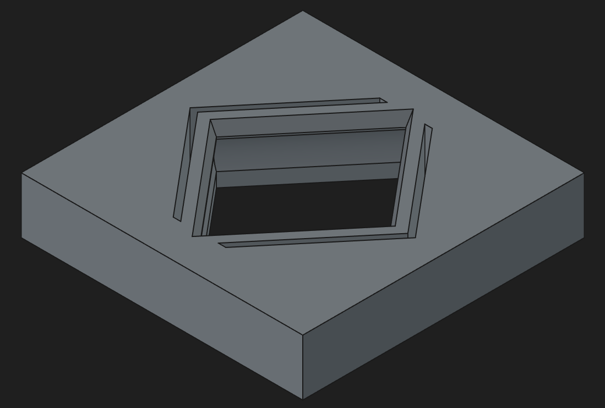
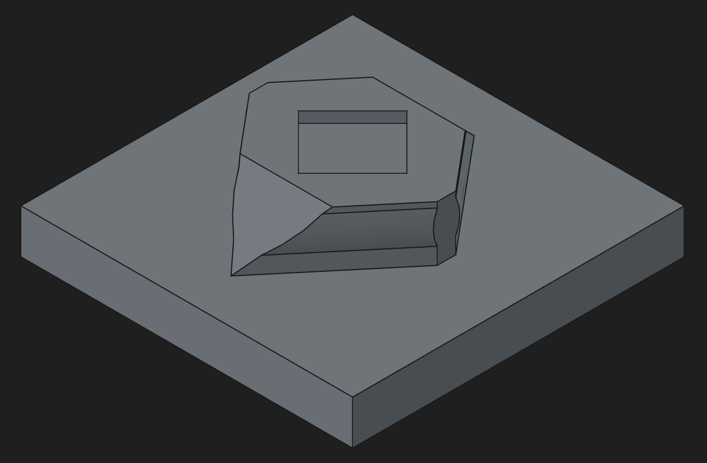
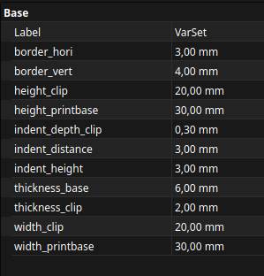

# FreeCAD_DElements
A collection of design elements to plop into FreeCAD designs to speed up 3D-printing adjacent MCAD work

# DockLink design block:

  
  

The DockLink design block is a mostly parametric assembly to quickly add feet to a 3D-printed part that can also be docked to the mating part to connect two 3D-printed parts. The default configuration is for adding small rubber feet (3M SJ5382, 1.9mm height, 6.35mm diameter) into its recess to allow chassis to be stacked/connected. The docking force can be easily adjusted by changing a single parameter, which defines the depth of the nose/notch (indent_depth_clip, 0.3mm by default), which is defined in DockLink_Female and is linked to the other parts/assemblies. The design is meant to be printed on the side, requiring no support material in the correct printing orientation.

The above configuration uses these parameters, which are defined in the female part of the assembly, which are linked in the male part:

  

